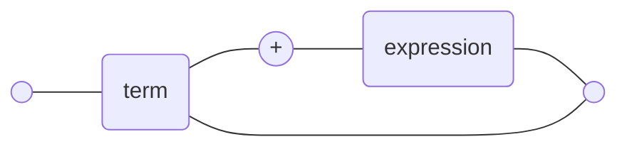

#linguistics  #parsing #computer_science 

Railroad diagrams are a way to represent a [[context-free grammar]]. So a way to diagram the rules for representing any possible string in a given, defined grammatical structure (a language).

> [!note] Obsidian supports [Mermaid](https:://mermaidjs.org) diagramming. Railroad diagrams _are_ technically available, but are specified as `gitGraph` (which is essentially the same thing). This isn't really a viable solution, so a flow chart needs to be used (the keyword used to define the chart type is either `flowChart` or `graph`).

As an example, using Mermaid syntax, a railroad diagram describing an addition operation ("1 + 1", for example):
 

---

This is a good subject for a small generator/parser, chance to get better at using Rust macros and/or Rust -> WASM. See [[projects/railroad_diagram_generator]].